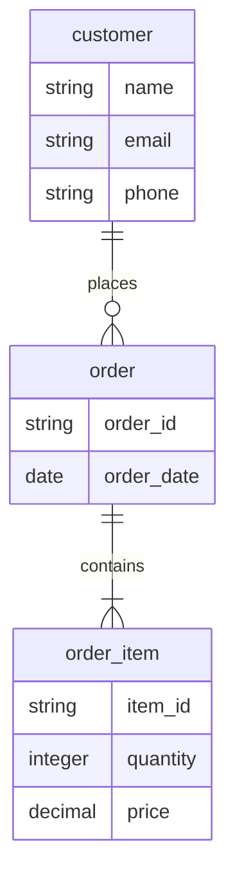
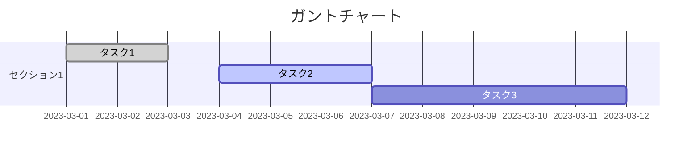
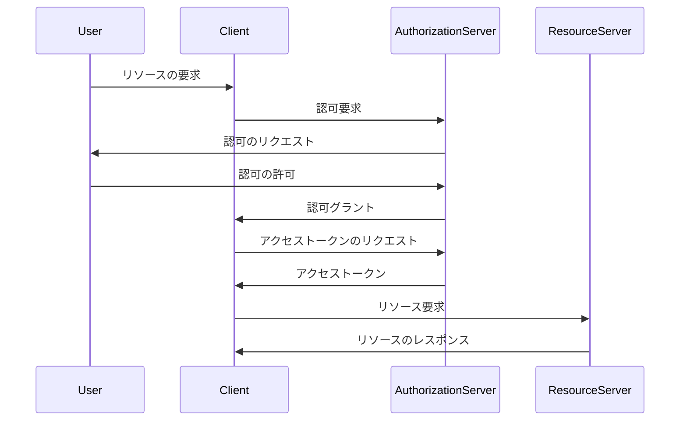

# chatGPT －　chatGPTで作図したい場合はmermaidを使う

chatGPTの答えを図にしたい  
と思う人は多いだろう  
そういうときは、
一旦、何らかのスクリプト形式で出力してもらうとよい  
おすすめはmermaid記法のドキュメントである  
シーケンス図、ガントチャート、ER図など  
さまざまな書式がある  

mermaid記法で書いたドキュメントは  
NotionやVsCode、githubなどで表示できる  

写真の図は、  
mermaid記法で  
chatGPTにER図のサンプル、  
ガントチャートのサンプル及び  
auth2.0のシーケンス図サンプルを出力依頼したもの  

 

